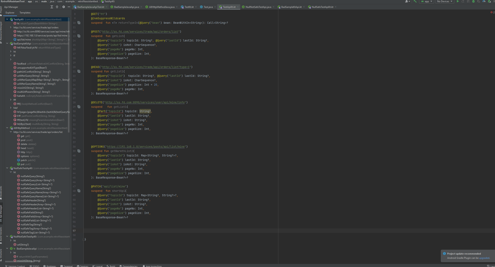

# Retrofit Assistant

- [简体中文](./README.zh_CN.md)

[][plugin]

[**Retrofit Assistant**][plugin] is a good helper for you to use the Retrofit framework, making it easier, more
efficient and safer for you to use Retrofit. You can think of it as approximately：

API management tools + code tools + code inspection and quickFix + code completion

> Supported Retrofit version >= 2.6.0

## Feature List

- API list tree, speed search and navigation
- Generate API intention
- Copy API
- API templates
- Provides quick fixes for creating APIs for unresolved methods
- add/modify Retrofit annotations
- url-based completion(**To avoid confusion with the IDE's built-in completion, you need to enter 'x' at the beginning
  to invoke this feature**)
- Extensive local API code inspection and quick fixes

> API list tree, speed search and navigation
> 

> Generate API intention
> 

> Copy API
> 

> Create API template
> 

> use API templates
> 

> Create API quick fix for unresolved method
> 

> add/modify Retrofit annotations
> 

> url-based completion
>
> Since this feature is not necessarily needed by every developer, and many times the URL and method name will be
> similar, the completion that comes with the IDE and this completion will be mixed together. In order to avoid this
> situation
>
> **This feature requires an 'x' at the beginning to enable completion**。
> 

> API code inspection and quick fix
> 

## How to install

- <kbd>Settings(windows:alt+shift+S;mac:command+,)</kbd> > <kbd>Plugins</kbd> > <kbd></kbd> > <kbd>type in "
  Retrofit Assistant"</kbd> > <kbd>Install Plugin</kbd>

[plugin]:https://plugins.jetbrains.com/plugin/22726-retrofit-assistant

