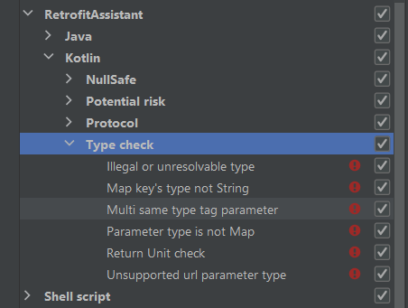

# Retrofit Assistant

- [简体中文](./README.zh_CN.md)

[][plugin]

[**Retrofit Assistant**][plugin] is a good helper for you to use the Retrofit framework, making it easier, more
efficient and safer for you to use Retrofit. You can think of it as approximately：

API management tools + code tools + code inspection and quickFix + code completion

> Supported Retrofit version >= 2.6.0

## Feature introduction

* Summarize all the retrofit APIS in the project into a tool window, the experience is similar to the Structure
  tool window, showing all the APIS in a tree form, you can enter path keywords in the window to filter the
  APIS, double-click or press enter for quick navigation.

* It provides a large number of local code checks and quick corrections, such as common missing annotations, incorrect
  parameter types, nullable types used in non-nullable parameters, and illegal characters in the header. Basically,
  unless it's intentional, it's hard to write an interface that doesn't make requests properly.

* You can use a dialog to create an API, experience a similar method to refactor dialog, and support multiple ways to
  open this dialog, including the replication line label generation method of the interface to quickly fix the Generate
  intent in the interface file.

* You can store the API as a template, for example, you can store the public URL prefix/return type/parameter/suspend
  keyword in the template, and you can load the template in the dialog to generate the API and quickly fill them.

* Retrofit annotations for methods and parameters can be updated by intent, which can be found by using the alt+Enter
  shortcut on methods or parameters.

* url-based code completion, When you need to complete an interface call or an interface type through a URL, you can
  enter an 'x', then you can use the URL to find the method and interface class, and enter can directly enter the method
  corresponding to the URL or the interface class where it is located.

* liveTemplate, the plugin has a batch of live templates embedded, for example, you can input 'retrofitApi' in the
  interface file to quickly generate an interface template, and input 'query' in the parameter position to add query
  parameters. This is useful for creating and modifying APIS.

If the project's interface documentation supports exporting Open API Specification 3.0 (OAS/swagger), the following
features will take effect and can greatly improve development efficiency.

* You can import remote or local oas into the IDE and view the interface documents in the IDE

* APIS can be grouped by whether they appear in the project or not, and APIS that have appeared can be
  navigated between documents and code. The grouping function allows you to quickly find new APIS during version
  iteration and version development.

* In the API creation dialog, the URL can be completed, and after the completion item is applied, the Retrofit API will
  be automatically generated based on the API document, including the corresponding comments.

* If you don't use the dialog to generate the API, you can call the completion shortcut to fill in the url and parameter
  when entering the key of the url and parameter, and the corresponding shortcut can be found in <kbd>Code</kbd>-><kbd>
  Code Completion</kbd>-><kbd>Basic</kbd>.

* You can move the cursor to the position of the parameter and call the intelligent completion of the interface method
  parameters. The corresponding shortcut keys can be found in <kbd>Code</kbd>-><kbd>Code Completion</kbd>-><kbd>
  Type-Matching</kbd>.

# Api manager tool window


This window summarizes all the APIS in the project, and displays them in a tree with their URLs, and you can
directly enter interface keywords in the window to quickly locate and navigate to the interface.

# Code inspection and quick fix

Code checks fall into four broad categories: protocol checks, null safety, type checks, and potential risks


## Protocol inspection

Protocol check checks whether the interface definition conforms to the specifications required by the Retrofit and HTTP
protocols,
such as missing annotations, conflicting request methods and parameters, missing parameters, or non-conforming
specifications. This kind of problem is not easy for experienced developers, but it may be careless, such as missing
@FormUrlencod on the interface using the @Field, @Part missing @Multipart, etc.,
the following figure shows all the protocol checks provided by the plugin, each check has a corresponding number of
quick fixes.


## Null safety

In Retrofit, not all arguments support passing null, and when using collections and maps, it may be required that the
elements in them are not nullable. In fact, everyone may encounter this kind of problem, because interface requests
generally do not produce crashes, online crash logs cannot be caught, and the argument on runtime are sometimes null,
then this problem will be very hidden, and may continue for several versions.

Luckily, Kotlin supports good null safety, and you just need to declare the type as non-null, and most null safety
issues will be exposed at compile time.

The kotlin version of null-safe code inspection checks for nullable retrofit annotations that use nullable types, and
the Java version checks for non-nullable annotations.

Kotlin


Java


## Type Inspection

Probably the most common problem encountered by developers in type problems is that some APIS need to be annotated
with @Jvm Suppress Wildcards, such as this one:

```kotlin
@FormUrlEncoded
@POST("foo/url")
fun fieldMap(@FieldMap qu: HashMap<String, Any>): Call<BaseResponse<Bean?>?>?
```

Now it's fine, but one day some guy felt that Hasp Map was not interface-oriented enough, so he changed it to Map

```kotlin
@FormUrlEncoded
@POST("ht")
fun fieldMap(@FieldMap qu: Map<String, Any>): Call<BaseResponse<Bean?>?>?
```

He probably thought that such a small change must be fine, and he committed it without test, the online glitch came.
Because this interface is 100% failing.

Here is another scenario:

```kotlin
@POST("foo/url")
fun fieldMapKey(@Body qu: List<Param>): Call<BaseResponse<Bean?>?>?
```

This interface has been working normally until one day when developing a new business, the parameters of other
APIS need to reuse the fields of Param, and in order to inherit Param, an open keyword is added to the Param
class, then the interface that is working normally must be 100% error.

The reason for the above two problems is that the type parameters of Map and List are modified with 'out' keyword, which
supports type **Covariant**, and will be compiled to wildcard types by default. For similar problems, the plugin will
give prompts and provide quick corrections at the first time.


All types of checks:



## Potential Risks

There is currently only one check for this,and when using the header, it will remind you to make sure that the header
does not have unsafe characters, as committed by [JakeWharton](https://github.com/JakeWharton) on the Okhttp github
[issue](https://github.com/square/okhttp/issues/891)
,If you find the warning intrusive, you can turn off this check in the settings.

# Create API dialog and API template

When you need to create a new API, you can choose to create an API through the Create API dialog


Here's an example of using templates and OAS to quickly generate an API (swagger supports the OAS in this doc):


In addition to the [Generate Code](https://www.jetbrains.com/help/idea/generating-code.html) method shown above, there
is also a quick fix for non-existent methods and a copy of the API's line marker to evoke this dialog

# URL-based code completion

Sometimes we forget the name of the method corresponding to an API, or we don't even know which interface file it is
defined in,
the latter is generally more common in modules that the interface does not belong to our responsibility,
the conventional method clicks into the interface file to find the method or searches globally through the URL,
but if you need to fill in the interface type and call the interface where you can complete it by URL, isn't it the same
as writing normal code?
Suppose you now need to call an interface that another colleague is responsible for: pet/config/price,
and you don't know the name of the function and the interface class it is in, then you can enter an 'x' where you need
the interface type and method,
and then enter the interface URL, and you can quickly complete the coding.


Anywhere you only remember the url of the interface but you need the interface class or interface function where the
interface is located,
you may be pleasantly surprised to type 'x' and then enter the url.

# Modify the annotation intent

When you need to change the annotation of a function or parameter,you can update the annotation by pressing the cursor
to place the cursor over the function or parameter, pressing alt+enter, and selecting 'Add Replacement Retrofit
Annotation'.


# Live Templates

[Live templates](https://www.jetbrains.com/help/idea/using-live-templates.html)
is a powerful feature of IDE to generate code quickly, I believe most developers have used it, and you can try it if you
haven't used it, and you may see each other late.

This plugin embeds more than 20 related Live Templates, allowing you to quickly write APIs by hand,for example, input
retrofitApi in the interface class to create an api code template, and fill in the request method, url, method name and
parameters in order to complete the interface creation.


To see all LiveTemplates, go to "Setting-Editor-Live Templates-RetrofitAssistant(KotlinJava)"

The above functions are the functions that the plugin can provide when there is no import of OAS, if your api
documentation supports OAS export, then it is highly recommended that you import oas, I believe you will find that the
writing interface has never been so silky.

# OAS 3.0(Swagger) support

The plugin has added support
for [OAS3.0(swagger)](https://github.com/OAI/OpenAPI-Specification/blob/main/versions/3.0.0.md) since version 2023.2.0,
this feature has actually been mentioned above,
and the author will take swagger as an example to introduce the use of this function.

## Sign up and log in to swagger

Go to [Swagger]() and sign up for an account and log in, and you will have a sample project with some sample rest api

## add swagger OAS to plugin

1. click the add button in the toolbar,select the remote oas,
2. Copy the URL of Swagger and paste to add oas dialog,change the URL from "https:app..." to "https:api..."
3. If your swagger is private, you will also need to copy your api key to the dialog when adding the OAS.
4. Enter, normally, you can now see the oas documentation in Retrofit OAS after loading completed.
   

### Add the first retrofit api


As shown in the animated gif, the recommended general process is:

1. Open the Generate option in the interface file (mac: <kbd>cmd+n</kbd>, windows: <kbd>alt+insert</kbd>)
2. Select Retrofit Api
3. Select API and enter the return type and method name
4. Navigate to the OAS documentation window to copy the JSON sample of the API response
5. Use the plugin to generate a model

> Tip: If there are a large number of APIs with the same prefix URL or the same return type or the same parameters in
> your project,
> it is recommended to store these parameters in a template, and you can quickly fill in the same content by loading the
> template when creating APIs.

### Update the API

Assuming that the oas you just added has been changed during development, for example, the path parameter:deviceId
has been changed to device_id,and a new query parameter:foo has been added,you can with 
[code completion and smart completion](https://www.jetbrains.comhelpideaauto-completing-code.html) to complete the api.
> Remember to click refresh in the Retrofit OAS window to get the latest changes, if it's a local OAS,
> you'll need to download a new oas json file and overwrite the current, then click refresh again.


### Use the URL completion API to make a call


The above is a general process for using OAS, please note that although the article uses api Fox as an example, it does not mean that apifox can only be used, 
in fact, since the OAS standard is an open and unified standard, any api management tool that supports exporting OAS 3 can be used。

## How to install

- <kbd>Settings(windows:alt+shift+S;mac:command+,)</kbd> > <kbd>Plugins</kbd> > <kbd></kbd> > <kbd>type in "
  Retrofit Assistant"</kbd> > <kbd>Install Plugin</kbd>

[plugin]:https://plugins.jetbrains.com/plugin/22726-retrofit-assistant

