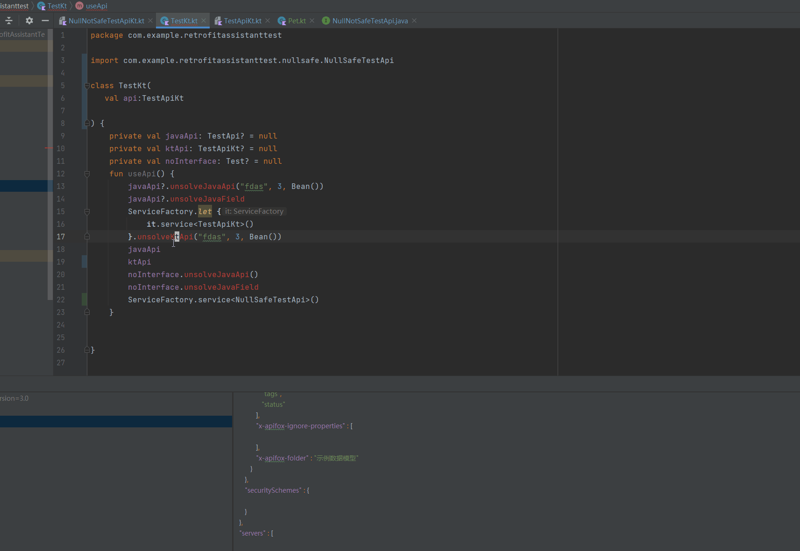

# Retrofit Assistant

- [English](./README.md)

[][plugin]

[**Retrofit Assistant**][plugin]是你使用Retrofit框架的好帮手，可以让你更加容易、高效、安全地使用Retrofit。你可以认为约等于：

API管理工具+代码工具+oas文档工具+代码检查及快速修正+代码补全

> 支持的Retrofit版本>=2.6.0
> 
> 支持的oas版本:3.0.x

## 功能简介

* 将项目中所有的Retrofit接口汇总到一个工具窗口中，体验类似于Structure工具窗口，以树状的形式展现所有接口，你可以在窗口中输入路径关键词来过滤接口双击或回车快速导航。

* 提供了大量的代码本地检查和快速修正，比如常见的缺失注解,参数类型不对,不可空参数使用了可空类型，header中存在非法字符等。基本上除非故意为之，不然很难写出不能正常发出请求的接口。

* 可以通过对话框来创建api,体验类似方法重构窗口，支持多种途径打开此对话框,包括接口的复制行标/生成不存在方法快速修正/接口文件中的Generate意图。

* 可以将接口存储为模板，比如可以将公共的url前缀/返回类型/参数/suspend关键字等存储于模板中，在生成api的对话框中可以加载模板，快速填入这些参数。

* 支持通过意图更新方法和参数的Retrofit注解，在方法或形参上使用alt+Enter快捷键可以找到。

* 基于url的代码补全，当你需要通过url来补全接口调用或者是接口类型时，你可以输入一个'x'
  ，此时你可以通过url来查找方法和接口类，enter就可以直接输入对应url所对应的方法或其所在的接口类。

* liveTemplate,插件预埋了批量的live template,比如你可以在接口文件中输入retrofitApi在快速生成接口模板，在参数位置输入query可以增加query参数。这对于新建和修改接口非常有用。

如果项目的接口文档支持导出Open Api Specification3.0(OAS/swagger),那么以下功能将会生效，并且可以大幅提升开发效率。

> 非后台同学可能不太了解oas,但实际上oas正逐步变为REST api文档的事实标准，常见的api
> 文档管理工具（比如swagger,apifox,apipost)都是支持oas的。后文会以apifox为例作详细介绍。

* 支持将远程/本地的oas文档导入IDE,可以直接在IDE中查看接口文档

* 支持对接口按是否在项目中有出现进行分组，已出现的接口可以在文档和代码间相互导航。分组功能可以让你再版本迭代和版本开发中快速找到新增的接口和尚未接入的接口。

* 在api创建对话框支持补全url，并且在应用补全条目后，会自动根据接口文档生成Retrofit Api，包括对应的注释。

* 如果你没有使用对话框生成api,那么在输入url和参数的key时，你可以主动调用补全快捷填入url和参数，对应快捷键可以在<kbd>Code</kbd>-><kbd>Code
  Completion</kbd>-><kbd>Basic</kbd>中找到。

*
支持在接口方法参数的基础补全和智能补全，不填入任何字符也可以快捷填入参数，可以将光标移至参数的位置，调用智能补全即可。对应快捷键可以在<kbd>Code</kbd>-><kbd>Code
Completion</kbd>-><kbd>Type-Matching</kbd>中找到。

# Api manager 窗口

先来看一下api manager窗口的gif截图

此窗口汇总了项目中的所有接口,并以其url做了树状展示，你可以直接在窗口中输入接口关键词来快速定位和导航到接口。

# 本地代码检查和快速修正

代码检查分为四个大类：协议检查，空安全，类型检查和潜在风险


## 协议检查

协议检查是指检查接口定义是否符合Retrofit和Http协议要求的规范，比如缺少注解/请求方式与参数冲突/参数缺失或不符合规范等。

此类问题对于有经验的使用者来说不太容易出现，但是可能会不小心，比如在使用了@Field的接口上遗漏了@FormUrlencod,@Part遗漏@Multipart等，下图是插件提供的所有协议检查,每个检查都有对应的若干快速修正。


## 空安全

在Retrofit中，并不是所有的参数都支持传递null,当使用集合和Map时，可能会要求当中的元素不可空。此类问题其实每个人都可能会遇到，由于接口请求一般都不会产生crash,线上crash日志捕捉不到，再加之动态参数有时会是空，那么此问题会很隐蔽，可能会延续好几个版本。

幸运的是Kotlin本身支持了良好的空安全，你只需将类型定义为非空的，那么大多数空安全的问题都会在编译期得以暴露。

空安全代码检查的kotlin版本就是检查不可空的Retrofit注解是否使用了可空类型，Java版本则是检查是否含有非空注解。

Kotlin


Java


## 类型检查

类型问题中开发者遇到最多的问题可能是有些接口需要加@JvmSuppressWildcards注解，比如这样一个接口：

```kotlin
@FormUrlEncoded
@POST("foo/url")
fun fieldMap(@FieldMap qu: HashMap<String, Any>): Call<BaseResponse<Bean?>?>?
```

现在是没问题的，但是有一天某位同学觉得HaspMap不够面向接口，改为了Map

```kotlin
@FormUrlEncoded
@POST("ht")
fun fieldMap(@FieldMap qu: Map<String, Any>): Call<BaseResponse<Bean?>?>?
```

他可能心想这么小的改动肯定没问题，直接提交，测试也没有回归到，那么好的，线上故障来了。。。因为此接口是100%失败的。

再列举这样一个场景：

```kotlin
@POST("foo/url")
fun fieldMapKey(@Body qu: List<Param>): Call<BaseResponse<Bean?>?>?
```

此接口一直正常工作，直到有一天开发新业务时，其他接口的参数要复用Param的字段，为了继承Param,给Param类加了个open关键字，那么，此时本来正常工作的接口肯定是100%报错的。

以上这两个问题究其原因都是由于Map和List的类型参数有out修饰，支持型变，默认会被编译成通配符类型导致。
对于类似的问题，插件都会在第一时间给出提示和提供快速修正。


全部类型检查：


## 潜在风险

此检查目前只有一个，当使用Header时，会提醒你要确保Header没有非安全的字符，此问题在Okhttp的github上[JakeWharton](https://github.com/JakeWharton)
有专门的[issue](https://github.com/square/okhttp/issues/891)
,介于大多数情况开发者并不能保证header满足此要求，故做一个小提醒，如果你有强迫症，觉得总是警告不舒服，可以在设置中关闭此检查。

# 创建Api对话框及api模板

当需要创建新的Api时，可以选择通过创建api对话框来创建api


下面是使用模板和oas快速生成api的样例（文章中的oas由apifox支持）：


除了上面展示的通过[Generate Code](https://www.jetbrains.com/help/idea/generating-code.html)
方式外，同时提供了未存在方法的快速修正和复制api的行标来唤起此对话框


动画中只是做演示之用，实际开发中可能需要更新参数名/注解及返回类型什么的。但如果是基于oas填充的参数则基本不用更改。或者可以将Map修改为实体类，你可以在oas窗口中找到文档的返回json样例，复制后使用json转实体的插件快速构建实体类（比如[SON To Kotlin Class](https://plugins.jetbrains.com/plugin/9960-json-to-kotlin-class-jsontokotlinclass-))


# 基于url的代码补全

有时我们会忘记某个api对应的方法名，或者干脆就连在哪个接口文件中定义都不知道，后者一般多见于接口不属于自己所负责的模块，常规方法点进接口文件查找方法或是通过url全局搜索，但是如果在需要填入接口类型和调用接口的地方能通过url补全，不就可以和正常写代码一样了么？

假设你现在需要调用其他同事负责的一个接口：/pet/config/price，此接口函数名和所在接口类你都不知道，那么你可以在需要接口类型和方法的地方先输入一个'x'
，然后接着输入接口url,就可以快速完成编码。


在任何你只记得接口地址的地方却需要接口所在的接口类或接口函数时，先输入'x'，再输入地址，可能会有惊喜。。

# 修改注解意图

当你需要更改函数或参数的注解时，你可以按下将光标置于函数或是参数处，按下alt+enter，选择'增加/替换Retrofit注解'来更新注解。


# Live Templates

[Live templates](https://www.jetbrains.com/help/idea/using-live-templates.html)
是IDE一个强大的快速生成代码的功能，我相信大多数开发者都有用过，没用过的老铁可以试下，你可能会相见恨晚。哈哈。

插件预埋了大约20多个相关的Live Template,让你可以快速手写Api，比如在接口类中输入retrofitApi即可创建一个api代码模板，依次填入请求方法，url，方法名和参数即可完成接口创建。


查看所有的LiveTemplates，请转到"Setting-Editor-Live Templates-RetrofitAssistant(Kotlin/Java)"

以上功能便是插件在没有导入OAS时所能提供的功能，如果你的api文档支持OAS导出，那么强烈建议你导入oas，相信你会发现写接口从没有如此丝滑过。。

# OAS 3.0(Swagger) 支持

插件从2023.2.0版本开始加入了对[OAS3.0(swagger)](https://github.com/OAI/OpenAPI-Specification/blob/main/versions/3.0.0.md)
的支持，此功能其实上文中已经有所提及，接下来笔者将以Apifox为例，介绍此功能的使用。

## 注册并登录Apifox

前往[Apifox官网](https://apifox.com/)注册一个账号并登录，登录后你会有个示例项目，当中已经定义了示例接口


## 下载Apifox桌面端应用（可选）

你可以选择下载桌面端应用，桌面端应用会启动一个本地服务，通过这个服务，插件可以更加方便地更新OAS。

## 添加OAS

下图为插件的OAS窗口


### 导出本地或是远程OAS


图中所示的打开URL只有桌面端才可以使用。
> 注意，添加远程OAS时，可能存在认证，比如swagger的非公开项目，需要在请求里携带Auth(apiKey),然而对于本样例，是不需要的，取消勾选Auth复选框即可。

添加OAS完毕后，界面应该是这样


### 添加第一个接口


正如动gif中展示，推荐的常规流程为：

1. 在接口中打开Genrate选项（mac:<kbd>cmd+n</kbd>，windows:<kbd>alt+insert</kbd>）
2. 选择RetrofitApi
3. 选择api并输入返回类型及方法名
4. 导航到oas文档窗口复制api response 的json样例
5. 使用插件生成model

你可以在很短的时间内完成api的接入，都不需要切出ide去打开和查看api文档，在ide中就可以完成接入。

> 小技巧：如果你项目中存在大量相同前缀url/相同返回类型/相同参数的接口，建议将这些参数存储到一个模板当中，创建api时可以通过加载模板来快速填入这些相同的内容。这个在后端为微服务架构中可能会有用。

### 更新接口

假设刚才接入的接口，在开发中发生了更改，比如name参数变为petName,增加了category和gender参数，那么此时可以通过[代码补全和智能补全](https://www.jetbrains.com/help/idea/auto-completing-code.html)
来应用接口更改。
> 记得在Retrofit OAS窗口中点击刷新获取最新更改，如果是本地OAS,则需要下载新的oas json文件并覆盖当前的，然后再点击刷新。


> 在后台同学通知你某个接口被更改后，想导航到目标接口时，别忘了可以通过Api manager或Retrofit OAS窗口快速导航到api哦。

### 通过url调用接口

现在你可以尝试一下使用url来完成接口调用了。。


以上便是使用的OAS的一个常规流程，请注意，虽然文章中以apiFox为例，但不代表只能使用apifox,事实上，由于OAS标准是一个开放和统一的标准，任何支持导出OAS3的api管理工具都可以使用。笔者同时也测试了OAS的开发和推广者(
smartbear)的工具:[Swagger](https://swagger.io/tools/),除了导入不同外，体验一致。

## 安装

- <kbd>Settings(windows:alt+shift+S;mac:command+,)</kbd> > <kbd>Plugins</kbd> > <kbd></kbd> > <kbd>输入"
  Retrofit Assistant"</kbd> > <kbd>Install Plugin</kbd>

[plugin]:https://plugins.jetbrains.com/plugin/22726-retrofit-assistant

