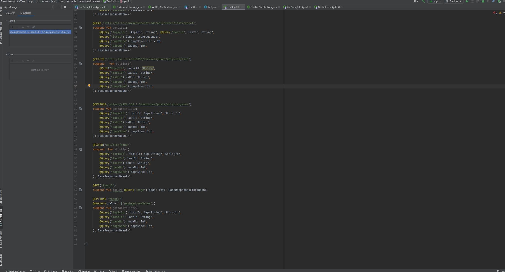
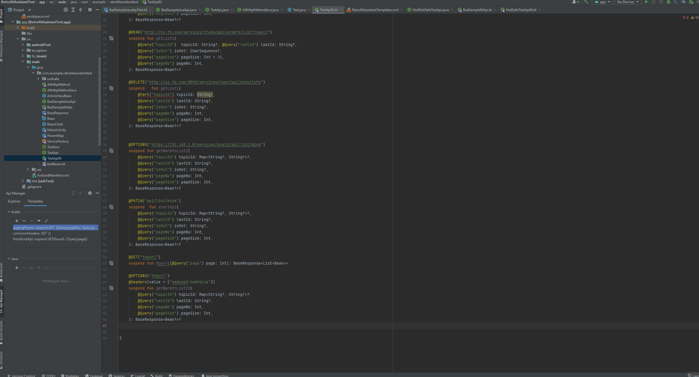
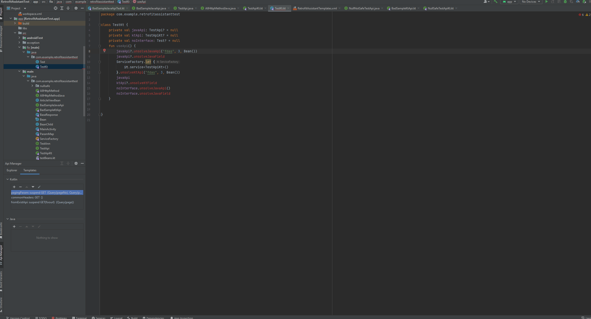
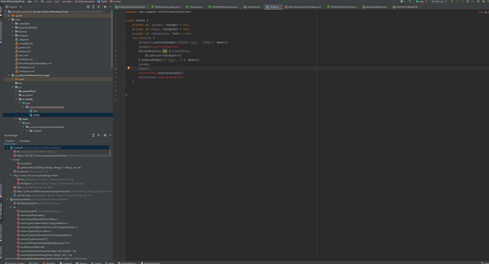

# Retrofit Assistant

- [English](./README.md)

[][plugin]

[**Retrofit Assistant**][plugin]是你使用Retrofit框架的好帮手，可以让你更加容易、高效、安全地使用Retrofit。你可以认为约等于：

API管理工具+代码工具+代码检查及快速修正+代码补全

> 支持的Retrofit版本>=2.6.0

## 功能列表

- API列表树、快速搜索及导航
- 生成API意图
- 复制API
- API模板
- 为未解析的方法提供创建API的快速修正
- 增加/修改Retrofit注解
- 基于Url的代码补全(**为了避免和IDE内置补全混杂，你需要在开头输入'x'以唤起此功能**)
- 大量的本地API代码检查及快速修正

> API列表树及导航
> 

> 生成API意图
> 

> 复制API
> 

> 创建API模板
> 

> 使用API模板
> 

> 创建API快速修正
> 

> 增加/修改Retrofit注解
> 

> 基于url的代码补全
>
> 由于此功能不确定不是每个开发者都需要，且很多时候url和方法名会比较类似，ide自带的补全和此补全会混杂在一起，为了避免这种情况，
>
> **此功能需要在开头处输入'x'以启用补全**。
> 

> API代码检查及快速修正
> 

## 安装

- <kbd>Settings(windows:alt+shift+S;mac:command+,)</kbd> > <kbd>Plugins</kbd> > <kbd></kbd> > <kbd>输入"
  Retrofit Assistant"</kbd> > <kbd>Install Plugin</kbd>

[plugin]: https://plugins.jetbrains.com/plugin/

