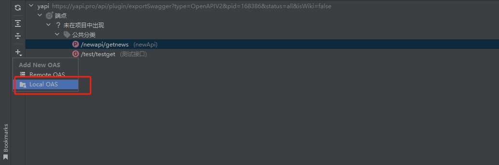
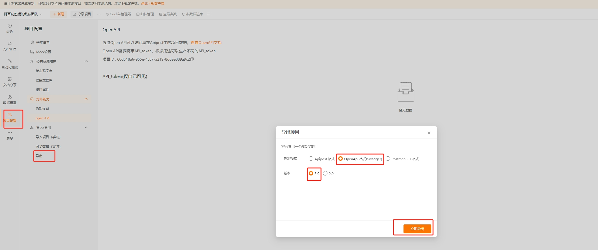

> apipost貌似不支持在线oas,只能导出文件到本地，导入为local oas
> 本地oas更新稍显麻烦，需要手动更新oas文件

1. 打开要导入的apipost项目，转到“项目设置”选项卡。
2. 点击导出，唤起导出对话框。
3. 导出格式选择openApi,3.0版本
4. 点击”立即导出“，导出到你认为合适的目录
5. 在ide中，打开添加本地oas对话框。
6. 选择刚才导出的文件
7. 取个名字，点击完成。
   
   
