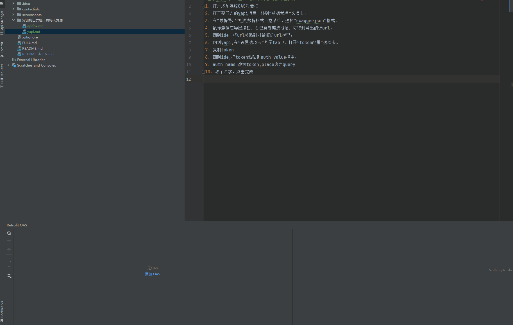

>由于yapi的oas是2.0的，要求插件版本至少为2023.2.4
1. 打开添加远程OAS对话框
2. 打开要导入的yapi项目，转到“数据管理”选项卡。
3. 在“数据导出”栏的数据格式下拉菜单，选择"swaggerjson"格式。
4. 鼠标悬停在导出按钮，右键复制链接地址，可得到导出的源url。
5. 回到ide，将url粘贴到对话框的url栏里。
6. 回到yapi,在”设置选项卡“的子tab中，打开”token配置“选项卡。
7. 复制token
8. 回到ide,把token粘贴到auth value栏中。
9. auth name 改为token,place改为query
10. 取个名字，点击完成。
